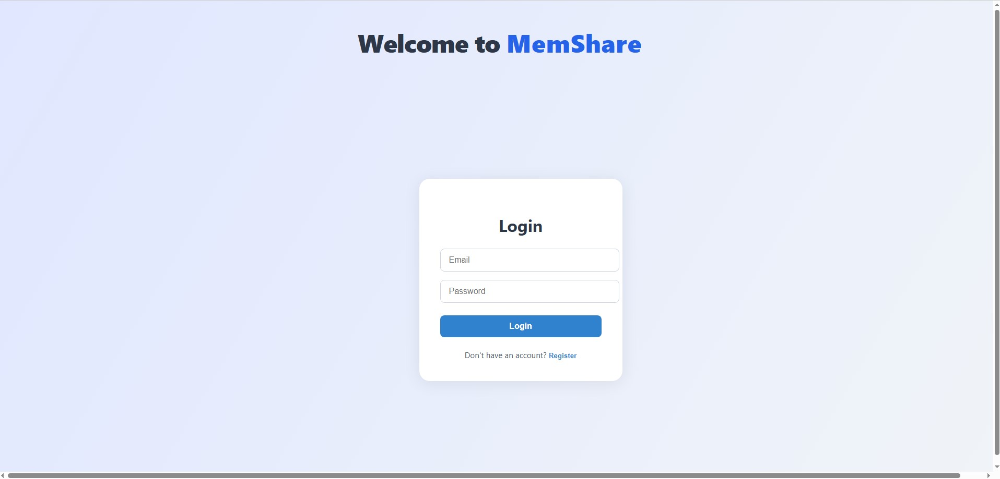
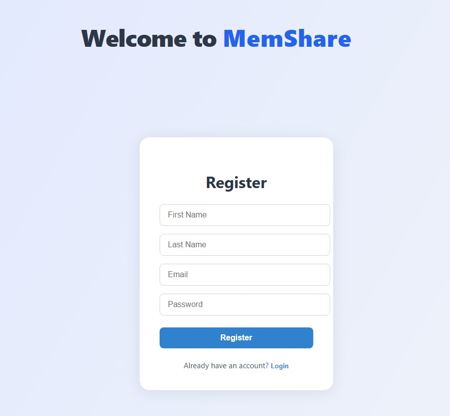
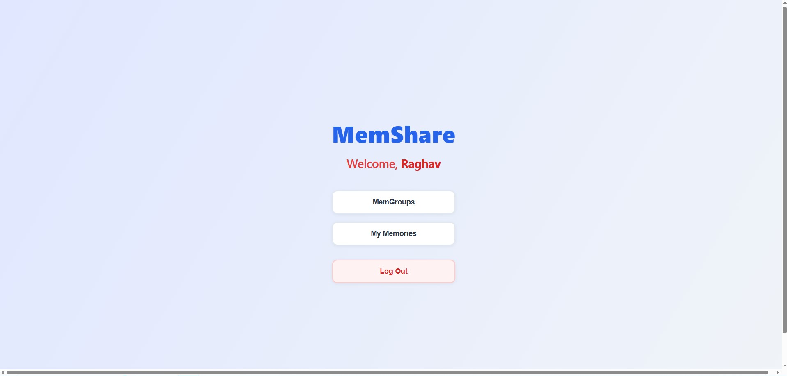
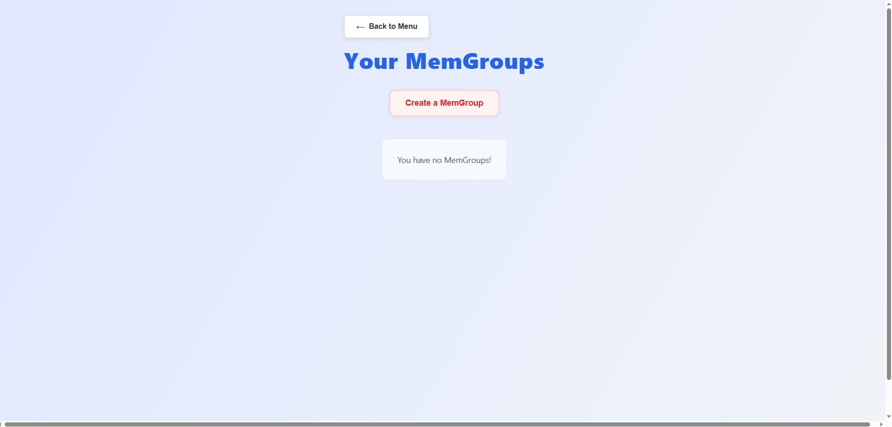
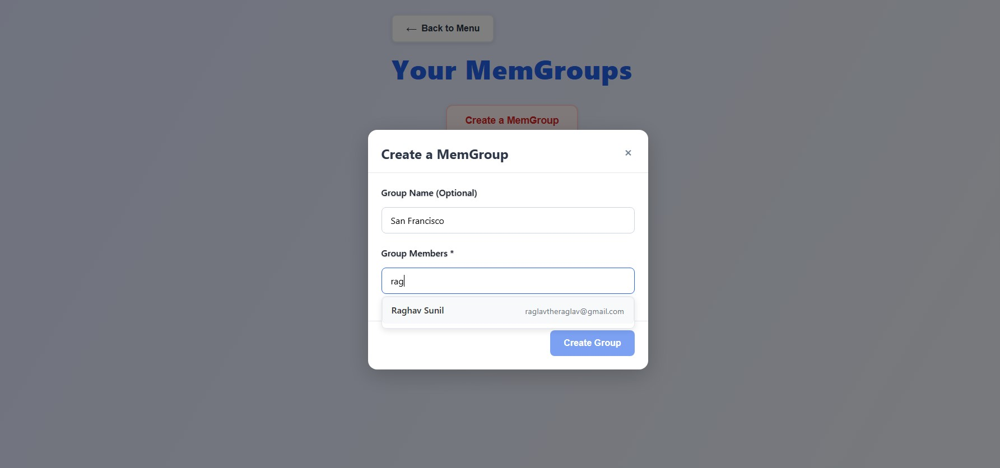
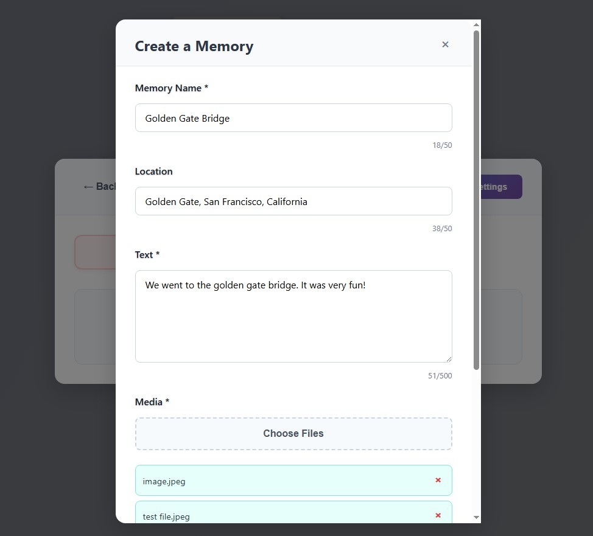
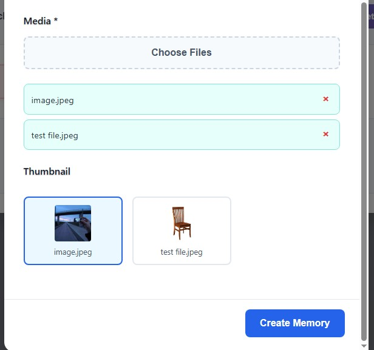
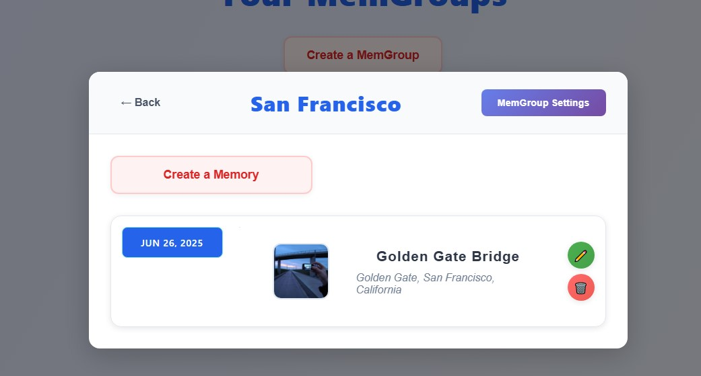
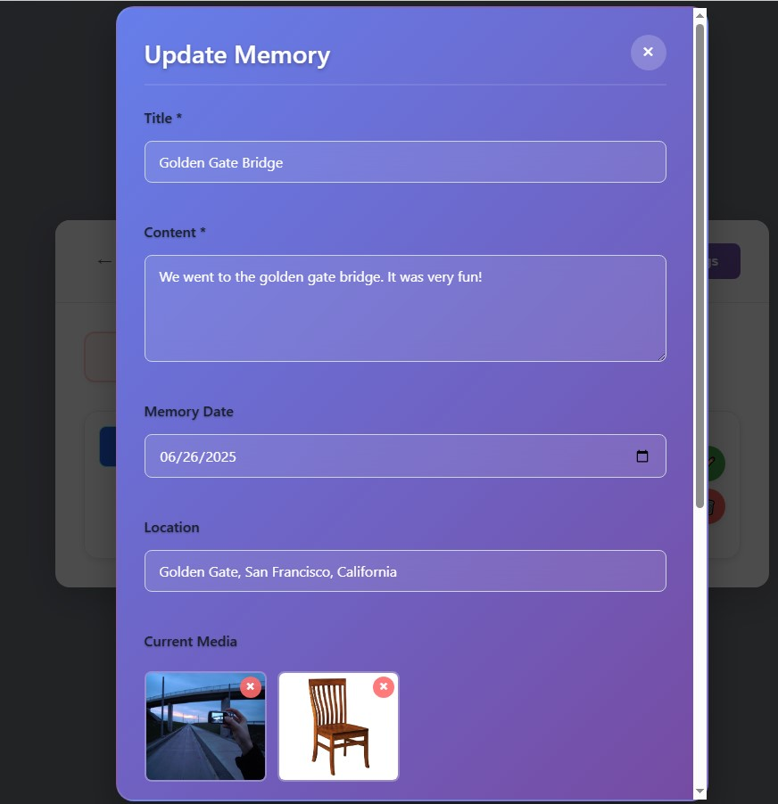
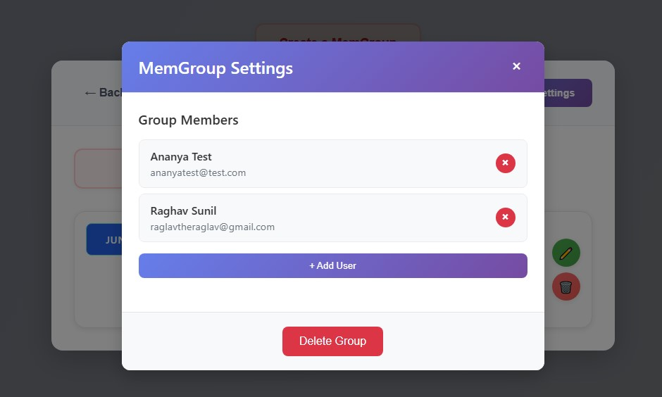

# MemShare

MemShare is a collaborative memory-sharing platform where users can create groups, add memories (with media), and share them with group members. The project consists of a React frontend and a Java Spring Boot backend, supporting user authentication, group management, and media uploads.

---

## Table of Contents
- [Features](#features)
- [Tech Stack](#tech-stack)
- [Project Structure](#project-structure)
- [Getting Started](#getting-started)
- [Usage Demo](#usage-demo)
- [Environment Variables](#environment-variables)
- [License](#license)

---

## Features
- User registration and login
- Create and manage memory groups (MemGroups)
- Add, edit, and delete memories with media (images)
- Group-based sharing and collaboration
- Media upload and thumbnail selection
- Secure authentication (JWT-based)
- Responsive, modern UI

---

## Tech Stack
- **Frontend:** React (TypeScript, Create React App)
- **Backend:** Spring Boot, Spring Security (Java)
- **Database:** PostgreSQL (configurable)
- **Media Storage:** AWS S3 (configurable)
- **Authentication:** JWT

---

## Project Structure

```
MemShare/
├── MemShareBackend/      # Java Spring Boot backend
├── memshare-frontend/    # React frontend (TypeScript)
└── README.md             # Project documentation
```

- **Backend:** Handles authentication, group/memory/media APIs, and database interaction.
- **Frontend:** Provides the user interface for all features.

---

## Getting Started

### Prerequisites
- Node.js & npm
- Java 17+ (for Spring Boot)
- PostgreSQL (for backend DB)
- (Optional) Docker

### 1. Clone the repository
```bash
git clone <your-repo-url>
cd MemShare
```

### 2. Backend Setup
```bash
cd MemShareBackend
# Configure environment variables in src/main/resources/application.properties
./mvnw spring-boot:run
```

### 3. Frontend Setup
```bash
cd memshare-frontend
npm install
npm start
```
The frontend runs on [http://localhost:3000](http://localhost:3000) and proxies API requests to the backend at [http://localhost:8080](http://localhost:8080).

---

## Usage Demo

Below is a walkthrough of the main features, illustrated with screenshots from the `READMEpics/` folder.

### 1. Login & Registration
**Login Screen:**


**Register Screen:**


---

### 2. Main Menu
After login, users are greeted and can navigate to MemGroups or their personal memories.


---

### 3. MemGroups
View your groups, create new ones, and manage members.


**Create a MemGroup:**


---

### 4. Memories
Create a memory with a title, location, text, and media files.


**Media part of Create a Memory:**


---

### 5. View & Edit Memories
View memories in a group, edit or delete them, and see all your memories in one place.


**Edit Memory:**


---

### 6. Group Settings
Manage group members and delete groups.


---

## Environment Variables
- Backend configuration: `MemShareBackend/src/main/resources/application.properties`
- Frontend proxy: `memshare-frontend/package.json`

---

## License
[MIT](LICENSE) (or your preferred license)

---

**Note:**
- For more details, see the individual READMEs in the frontend and backend folders. 